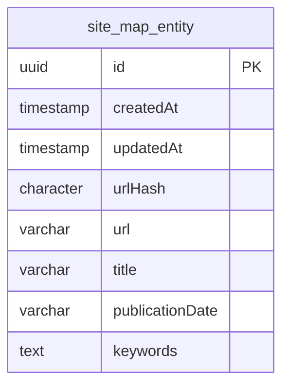

# Ingestion

A NestJS-based backend service for ingesting and querying news sitemaps.

## Tech Stack

- **Framework:** NestJS  (TypeScript)
- **Database:** PostgreSQL via TypeORM

## Getting Started

### Prerequisites

- Node.js, pnpm
- Docker (for PostgreSQL and Redis)

### Setup

```bash
# Start PostgreSQL and Redis
docker compose up -d

# Install dependencies
pnpm install

# Run the server
pnpm nx serve server
```

The server starts at `http://localhost:3000` by default.

### Environment Variables

| Variable | Default | Description |
|---|---|---|
| `SERVER_HOST` | `0.0.0.0` | Server bind address |
| `SERVER_PORT` | `3000` | Server port |
| `SERVER_URL` | — | Base URL shown in Swagger docs |
| `POSTGRES_HOST` | `localhost` | PostgreSQL host |
| `POSTGRES_PORT` | `5432` | PostgreSQL port |
| `POSTGRES_USER` | `user` | PostgreSQL user |
| `POSTGRES_PASSWORD` | `password` | PostgreSQL password |
| `POSTGRES_NAME` | `postgres` | PostgreSQL database name |
| `REDIS_HOST` | `127.0.0.1` | Redis host |
| `REDIS_PORT` | `6379` | Redis port |
| `REDIS_DB` | `0` | Redis database index |
| `REDIS_USERNAME` | — | Redis username (optional) |
| `REDIS_PASSWORD` | — | Redis password (optional) |
| `REDIS_TLS` | `false` | Enable TLS for Redis |

---

## API Reference

All routes are prefixed with `/v1`.

### Health

#### `GET /health`

Returns a health check message.

**Response**
```json
{ "message": "Health Check" }
```

---

### Sitemap

#### `GET /sitemap`

List stored sitemap entries with optional time-range filters and pagination.

**Query Parameters**

| Parameter | Type | Default | Description |
|---|---|---|---|
| `after` | ISO 8601 string | — | Return entries published after this timestamp |
| `before` | ISO 8601 string | — | Return entries published before this timestamp |
| `page` | number | `1` | Page number (1-indexed) |
| `limit` | number | `10` | Items per page |

**Response** — `SitemapPageDto`
```json
{
  "data": [
    {
      "id": "uuid",
      "url": "https://...",
      "title": "Article title",
      "publicationDate": "2024-01-01T00:00:00Z",
      "keywords": ["keyword1", "keyword2"],
      "createdAt": "2024-01-01T00:00:00Z",
      "updatedAt": "2024-01-01T00:00:00Z"
    }
  ],
  "total": 100,
  "page": 1,
  "limit": 10,
  "totalPages": 10
}
```

Entries are ordered by publication date (descending).

---

#### `GET /sitemap/ingest`

Fetches the latest news sitemap from NDTV (`https://www.ndtv.com/sitemap/google-news-sitemap`), parses it, and upserts entries into the database.

**Response** — array of the entries that were ingested in this request (not the full table).

Duplicate URLs are detected via an MD5 hash of the URL and skipped if no values changed.

---

## Database Schema


